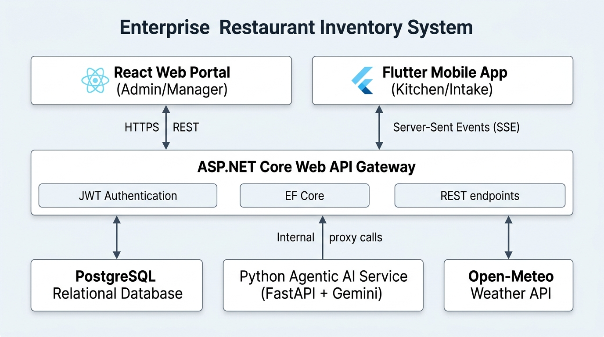
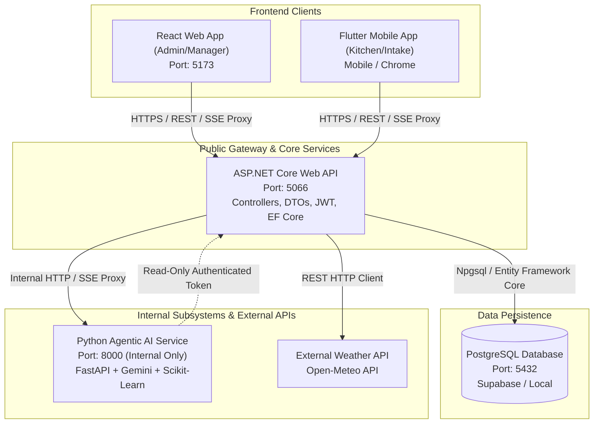
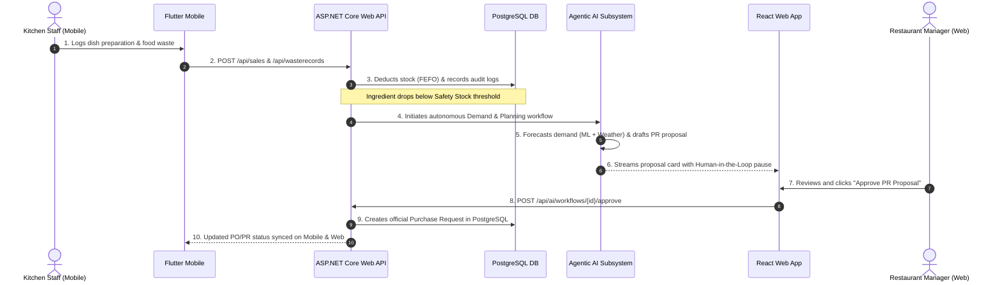
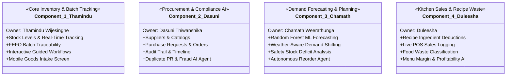
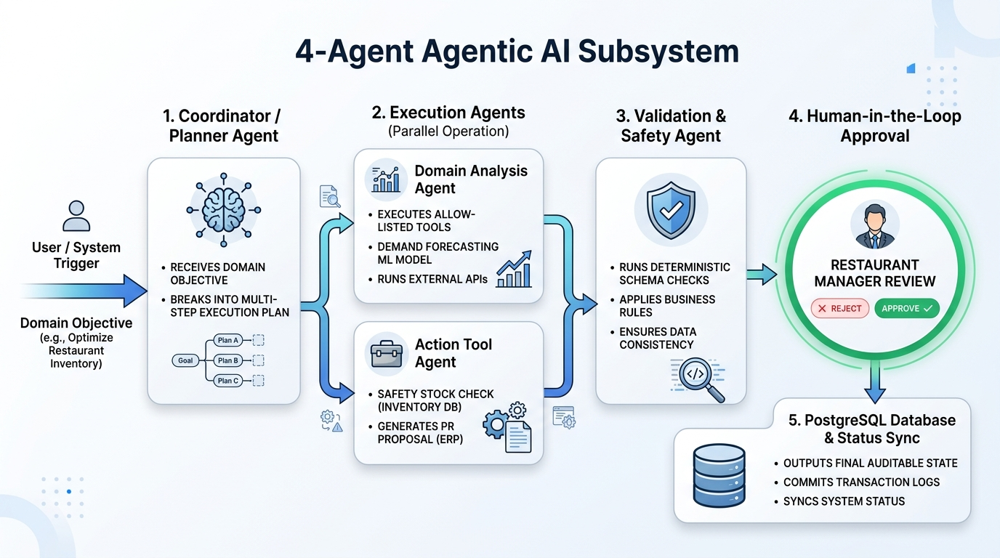
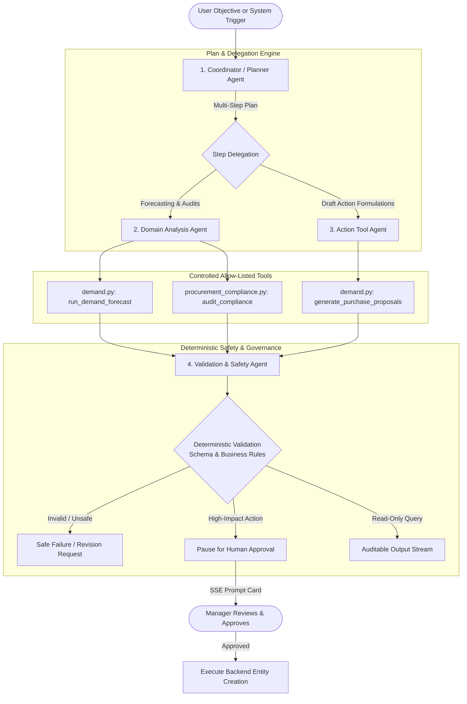

# SavoryInventory — Integrated Full-Stack & Agentic AI Restaurant System

> **SE3090 — Software Engineering Frameworks (Year 3, Semester 1 | 2026)**  
> **Assignment 1 — Group Full-Stack and Agentic AI Application Development**  
> **Domain:** Restaurant Inventory, Procurement, Recipe Consumption & AI-Powered Demand/Compliance Management

---

## 1. Executive Summary

**SavoryInventory** is an enterprise-grade restaurant inventory and procurement management platform engineered to resolve the classic disconnect between front-of-house kitchen prep, commercial vendor procurement, storeroom shelf-life tracking, and predictive replenishment.

The system combines:
1. An authoritative **ASP.NET Core 10 Web API** backend with Entity Framework Core and PostgreSQL.
2. A responsive **React (TypeScript)** administration and management portal styled with Acumatica Cloud ERP aesthetics.
3. A cross-platform **Flutter (Dart)** mobile application designed for kitchen staff, storekeepers, and floor managers.
4. A multi-agent **Python (FastAPI + Google Gemini + Scikit-Learn)** Agentic AI subsystem operating strictly as an internal service proxied by ASP.NET Core.
5. Live third-party **Weather Intelligence (Open-Meteo API)** integration that correlates meteorological forecasts with culinary ingredient demand.

---

## 2. System Architecture & Component Diagram

### Reference Integration Architecture

<p align="center">
  
</p>

As mandated by Section 10 of the SE3090 specification, the ASP.NET Core backend is the **sole public API**. Neither the React web application nor the Flutter mobile application directly accesses the PostgreSQL database or the internal Python Agentic AI service.



---

## 3. Mandatory Architectural Rules & Cross-Platform Flow

### 3.1 Strict Backend Proxy Pattern
* **Rule:** React and Flutter must communicate **only** with the ASP.NET Core Web API.
* **Implementation:** The Python Agentic AI service runs internally on `http://localhost:8000`. When a client initiates AI interaction, it calls the ASP.NET Core endpoint `POST /api/ai/chat`. The backend establishes an authenticated streaming proxy (`IAiProxyService`) to forward Server-Sent Events (SSE) directly to the client. The AI service token carries the restricted `AI_SERVICE` role and is never exposed to client browsers or mobile devices.

### 3.2 End-to-End Cross-Platform Workflow Pattern



---

## 4. User Roles & Permission Matrix (RBAC)

The application enforces fine-grained Role-Based Access Control (RBAC) backed by ASP.NET Core JWT policies.

| Role | Responsibility | Web Access | Mobile Access | Protected Operations |
| :--- | :--- | :---: | :---: | :--- |
| **SYSTEM_ADMIN** | Superuser & System Configuration | Full Access | Full Access | Master data, users, roles, system overrides |
| **RESTAURANT_MANAGER** | Operational Decision Maker & Approver | Full Access | Full Access | Approve PR/PO, view analytics, AI workflow approvals |
| **INVENTORY_MANAGER** | Storekeeper & Stock Controller | Stock, Recipes | Receiving, Stock | Stock intake, batch audits, manual adjustments |
| **PROCUREMENT_OFFICER** | Commercial & Supplier Specialist | Procurement | Receiving | Vendor management, PO creation, dispatch |
| **SALES_KITCHEN_STAFF** | Front-of-House & Line Cook | Kitchen POS | Kitchen Hub | Dish prep consumption, waste logging |

### Procurement & Supplier Permission Guardrails
Per business governance requirements, access to commercial vendor contracts, purchase requests, and purchase orders is strictly limited:
* `SuppliersController`: Restricted to `SYSTEM_ADMIN`, `RESTAURANT_MANAGER`, and `PROCUREMENT_OFFICER`.
* `PurchaseRequestsController`: Creation/editing restricted to `RESTAURANT_MANAGER`, `PROCUREMENT_OFFICER`, and `SYSTEM_ADMIN`. Approval restricted to `RESTAURANT_MANAGER` and `SYSTEM_ADMIN`.
* `PurchaseOrdersController`: Order issuance restricted to `PROCUREMENT_OFFICER` and `RESTAURANT_MANAGER`. Approval restricted to `RESTAURANT_MANAGER` and `SYSTEM_ADMIN`.
* Frontend `Navbar.tsx` and `App.tsx`: Automatically hide procurement tabs and redirect unauthorized roles.

---

## 5. Four Student Business Components

As required by Section 3 of the SE3090 specification, each student takes primary technical ownership of one distinct business component across the entire stack:



### Component Details:
1. **Component A: Core Inventory Management & FEFO Batch Intake**
   * **Lead:** Thamindu Wijesinghe
   * **Scope:** Real-time ingredient tracking, safety stock levels, storage location mapping, First-Expired, First-Out (FEFO) automated allocation, interactive guided tours (`GuidedWorkflowsController.cs`), and Flutter mobile stock intake UI.
   * **Endpoints:** `GET /api/inventory`, `GET /api/inventory/low-stock`, `POST /api/inventory/adjust`, `GET /api/inventory/movements`, `GET /api/inventory/batches/{id}/history`.
   * **Beyond-CRUD Operation:** Automated FEFO stock deduction engine with expiry date threshold notifications.

2. **Component B: Procurement Governance & Compliance Investigation**
   * **Lead:** Dasuni Thiwanshika
   * **Scope:** Supplier directory, purchase request approvals, commercial purchase order dispatch, goods receipt reconciliation, and AI-driven duplicate request / receiving discrepancy detection.
   * **Endpoints:** `GET/POST /api/suppliers`, `POST /api/purchaserequests/{id}/submit`, `POST /api/purchaserequests/{id}/approve`, `POST /api/purchaseorders/{id}/order`, `GET /api/goodsreceipts`.
   * **Beyond-CRUD Operation:** Chronological transaction timeline tracing with weighted risk scoring and duplicate request identification across temporal windows.

3. **Component C: Demand Forecasting & Agentic AI Planning**
   * **Lead:** Chamath Weerathunga
   * **Scope:** Machine learning demand regression (`RandomForestRegressor`), weather factor adjustment, safety stock evaluation, stock deficit calculations, and automated draft purchase order generation.
   * **Endpoints:** `POST /api/planning/forecast`, `GET /api/planning/deficits`, `POST /api/planning/propose-reorders`.
   * **Beyond-CRUD Operation:** Multi-step autonomous planning pipeline translating ML sales forecasts into scheduled procurement drafts.

4. **Component D: Kitchen Operations, Recipe Deductions & Waste Analytics**
   * **Lead:** Duleesha
   * **Scope:** Bill of materials / recipe versioning, POS order sales logging, kitchen consumption tracking, food waste reason recording, and kitchen staff mobile logging.
   * **Endpoints:** `GET/POST /api/recipes`, `POST /api/sales`, `POST /api/wasterecords`, `POST /api/wasterecords/{id}/confirm`.
   * **Beyond-CRUD Operation:** Automatic proportional ingredient batch deduction from physical inventory upon confirmation of meal sales.

---

## 6. Agentic AI Subsystem Architecture (Section 9)

<p align="center">
  
</p>

The AI subsystem solves complex multi-step problems without relying on single-prompt shortcuts. It implements **four specialized, distinct agents** operating over a shared state with deterministic safety guardrails.



### The 4 Specialized Agents:
1. **Coordinator / Planner Agent:** Receives the natural language prompt or threshold trigger, formulates an ordered multi-step execution plan, and routes subtasks to appropriate specialists.
2. **Domain Analysis Agent:** Analyzes live backend metrics, executes trained Scikit-Learn regression models, checks temporal patterns, and audits purchase history.
3. **Action / Tool Agent:** Formulates structured, validated tool payloads (e.g. drafting purchase requests for low-stock ingredients).
4. **Validation & Governance Agent:** Verifies output schemas against deterministic business rules, enforces read-only access for untrusted queries, and ensures high-impact mutations pause for human approval.

---

## 7. Third-Party Service Integration

* **Service:** Open-Meteo Weather API (`WeatherService.cs` & `WeatherController.cs`).
* **Business Justification:** Restaurant customer demand is highly sensitive to precipitation and ambient temperature. For example, rainy and cold conditions historically increase demand for hot soups and noodle dishes by up to 25% while decreasing demand for cold salads.
* **Architecture:** The ASP.NET Core backend queries Open-Meteo with server-side caching (60-minute TTL) to respect external rate limits and protect against external API downtime. Weather conditions are passed as feature inputs into the Scikit-Learn demand forecasting pipeline.

---

## 8. Test Accounts & Pre-Seeded Credentials

All test accounts share the default password: **`Password123!`**

| Email | Role | Recommended Testing Focus |
| :--- | :--- | :--- |
| `admin@restaurant.com` | `SYSTEM_ADMIN` | Master data, full configuration, system overrides |
| `manager@restaurant.com` | `RESTAURANT_MANAGER` | PR/PO approvals, AI proposal authorizations, analytics |
| `inventory@restaurant.com` | `INVENTORY_MANAGER` | Stock movements, FEFO batches, mobile goods intake |
| `procurement@restaurant.com` | `PROCUREMENT_OFFICER` | Vendor catalogs, purchase orders, compliance audits |
| `staff@restaurant.com` | `SALES_KITCHEN_STAFF` | Kitchen prep, POS order sales, food waste recording |

---

## 9. Technology Stack Summary

| Layer | Framework / Technology | Version | Purpose |
| :--- | :--- | :--- | :--- |
| **Backend API** | ASP.NET Core Web API (C#) | .NET 10 | Authoritative REST API, JWT RBAC, Business Rules |
| **Database** | PostgreSQL | 18 / Supabase | Relational data persistence, ACID transactions |
| **ORM** | Entity Framework Core | 10.0.4 | Code-first migrations, DbContext, LINQ queries |
| **Web App** | React + TypeScript + Vite | React 19 / Vite 8 | Admin portal, Acumatica ERP UI, AI Copilot |
| **Mobile App** | Flutter + Dart | Flutter 3.38+ | Kitchen prep logging, goods intake, mobile AI chat |
| **Agentic AI** | Python + FastAPI + Google Gemini | Python 3.12 | Multi-agent orchestration, SSE stream, ML forecasting |
| **Machine Learning**| Scikit-Learn + Joblib | 1.6+ | Random Forest demand regression model |
| **CI/CD** | GitHub Actions | v4 | Automated restore, build, and test verification |

---

## 10. Local Setup & Startup Instructions

### Prerequisites
* .NET SDK 10.0+
* Node.js 20+ and npm
* Flutter SDK 3.29+
* Python 3.12+
* PostgreSQL instance (Local or Supabase)

### Step 1: Database & Backend Setup
```bash
cd backend/RestaurantInventory.API

# Update ConnectionStrings:DefaultConnection in appsettings.json if using local PostgreSQL
dotnet restore
dotnet ef database update
dotnet run
```
* Backend runs at: `http://localhost:5066`
* Swagger UI: `http://localhost:5066/swagger`

### Step 2: Python Agentic AI Service Setup
```bash
cd ai-service

# Create and activate virtual environment
python -m venv .venv
.venv\Scripts\activate    # Windows (or source .venv/bin/activate on Linux/Mac)

pip install -r requirements.txt
python -m uvicorn main:app --host 0.0.0.0 --port 8000 --reload
```
* Internal service runs at: `http://localhost:8000`

### Step 3: React Web Application Setup
```bash
cd frontend/restaurant-web
npm install
npm run dev
```
* Web application runs at: `http://localhost:5173`

### Step 4: Flutter Mobile Application Setup

#### For Web/Chrome testing:
```bash
cd mobile/restaurant_mobile
flutter pub get
flutter run -d chrome
```

#### For Physical Android Device via USB:
```bash
# Bridge host ports over USB
adb reverse tcp:5066 tcp:5066
adb reverse tcp:8000 tcp:8000

# Run on physical device
flutter devices
flutter run -d <your-device-id>
```

---

## 11. Automated Testing & Verification

The solution includes automated unit, integration, and agentic evaluation test suites across all project tiers:

### 1. Backend Integration Tests (.NET)
```bash
dotnet test backend/RestaurantInventory.IntegrationTests
```

### 2. Flutter Unit & Widget Tests
```bash
cd mobile/restaurant_mobile
flutter test
```
* Validates user authentication models, stock deficit calculations, batch expiry alarms, Goods Intake UI, Kitchen Hub, and the AI Assistant chat interface (18 tests passing).

### 3. Agentic AI Compliance & Security Tests
```bash
cd ai-service
python tests/run_procurement_tests.py
python -m unittest tests/test_demand_agentic_planning.py
```
* Validates duplicate purchase request scoring, PR-to-PO financial variances, unapproved workflow detection, read-only safety guarantees, and deterministic output schema checks (37+ tests passing).

### 4. Continuous Integration Pipeline (GitHub Actions)
* Configured in `.github/workflows/ci.yml`.
* Automatically triggers on every push and pull request to verify:
  1. .NET 10 solution restore, build, and test execution.
  2. React TypeScript type checking and production Vite bundle build.
  3. Flutter test suite execution.
  4. Python dependency installation and AI security regression tests.

---

## 12. Architecture Decision Records (ADRs)

Detailed architectural justifications are preserved in the `docs/` repository directory:
* **ADR 01: State Management in React** — Selected Context API with specialized hooks (`useAuth`, `GuidedWorkflowProvider`) to prevent over-engineering while providing zero-boilerplate reactivity.
* **ADR 02: State Management in Flutter** — Selected the `Provider` pattern with `ChangeNotifier` for clean separation between UI widgets and HTTP service layers.
* **ADR 03: Agentic AI Proxy Architecture** — Enforced an internal FastAPI microservice proxied exclusively through ASP.NET Core via SSE, ensuring zero client exposure of AI infrastructure.
* **ADR 04: Relational Workflow State Persistence** — Maintained execution summaries and approval IDs in PostgreSQL while rejecting storage of hidden reasoning or raw LLM tokens.

---

## 13. License & Academic Declaration

This project was developed exclusively for academic evaluation under **SE3090 — Software Engineering Frameworks** at **SLIIT (Faculty of Computing)**. All third-party libraries, icons, and frameworks have been acknowledged.
